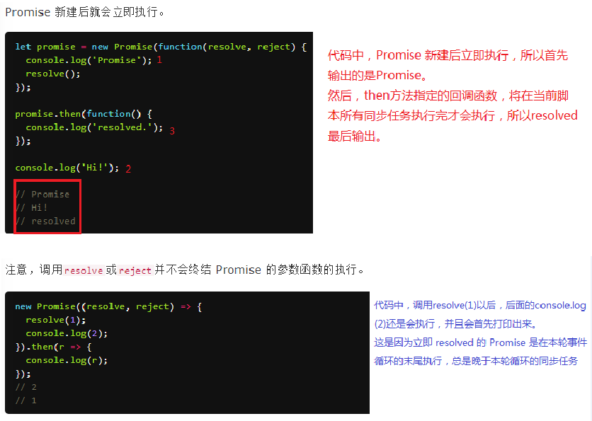
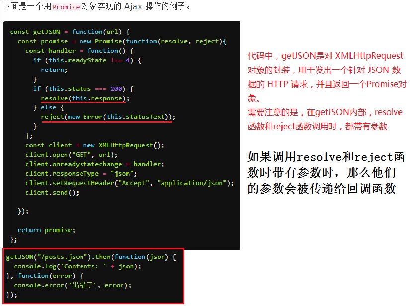

# 介绍
    是一种异步编程的解决方案
# 状态
    Promise对象只能从pending状态变成fulfilled状态，或从pending状态变成rejected状态，不会有其他状态之间的转变
    Pending：初始状态，不是成功或失败状态
    Fulfilled(或resolved)；意味着操作成功
    Rejected：意味着操作失败
# 主要作用：解决异步回调的问题
    1、 定义
    let m = 10;
    let promise = new Promise(function (resolve, reject) {
        //resolve：成功调用  //reject：失败调用
        if (m == 10) {
            resolve('成功');
        } else {
            reject('失败');
        }
    });
    
    2、使用
    调用使用：promise.then(成功回调，失败回调);
    promise.then(result=>{
        console.log(result);
    },error=>{
        console.log(result);
    })
    
    一般这样写
    promise.then(result=>{
        console.log(result);
    }).catch(error=>{
        console.log(error);
    })

# 如何将对象转换为Promise对象
    将现有的数据转换为一个Promise对象，而且是resolve状态，成功状态
    Promise.resolve('aaa')
    
    将现有的数据转换为一个Promise对象，而且是reject状态，失败状态
    Promise.reject('aaa')
    
    p1和p2是等价的
    let p1=Promise.resolve('aaa');
    let p2=new Promise(resolve => {
        resolve('aaa');
    });

# Promise对象一旦创建，就会立即执行
    

# 操作AJAX
