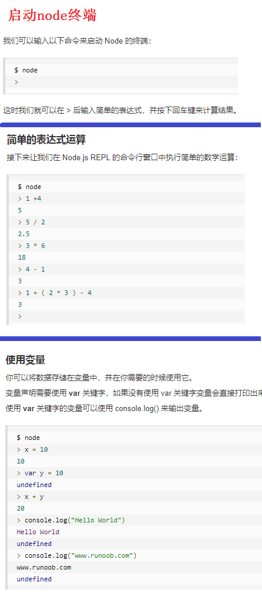

# 介绍：交互式解释器 Read Eval Print Loop
    Node.js REPL表示一个电脑的环境，类似 Window 系统的终端或 Unix/Linux shell，我们可以在终端中输入命令，并接收系统的响应。
    Node 自带了交互式解释器，可以执行以下任务：
    a. 读取 - 读取用户输入，解析输入了Javascript 数据结构并存储在内存中。
    b. 执行 - 执行输入的数据结构
    c. 打印 - 输出结果
    d. 循环 - 循环操作以上步骤直到用户两次按下 ctrl-c 按钮退出。
    Node 的交互式解释器可以很好的调试 Javascript 代码。
    
    启动node终端命令：node 并允许代码
 

# 常用命令
    ctrl + c - 退出当前终端。
    ctrl + c 按下两次 - 退出 Node REPL。
    ctrl + d - 退出 Node REPL.
    向上/向下 键 - 查看输入的历史命令
    tab 键 - 列出当前命令
    .help - 列出使用命令
    .break - 退出多行表达式
    .clear - 退出多行表达式
    .save filename - 保存当前的 Node REPL 会话到指定文件
    .load filename - 载入当前 Node REPL 会话的文件内容。
