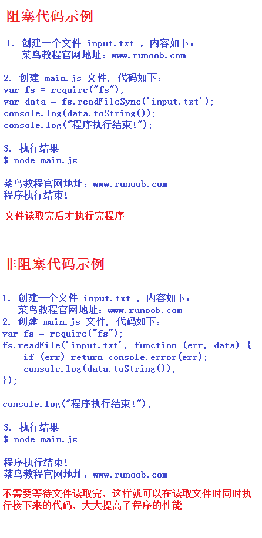

# 介绍
    1. 简单的说 Node.js 就是运行在服务端的 JavaScript。
    2. Node.js 是一个基于Chrome JavaScript 运行时建立的一个平台。
    3. Node.js是一个事件驱动I/O服务端JavaScript环境，基于Google的V8引擎，V8引擎执行Javascript的速度非常快，性能非常好。
    4. 如果我们使用PHP来编写后端的代码时，需要Apache 或者 Nginx 的HTTP 服务器，并配上 mod_php5 模块和php-cgi。从这个角度看，整个"接收 HTTP 请求并提供 Web 页面"的需求根本不需 要 PHP 来处理
    5. 使用 Node.js 时，我们不仅仅 在实现一个应用，同时还实现了整个 HTTP 服务器

# Nodejs的组成部分
    1. 引入 required 模块：我们可以使用 require 指令来载入 Node.js 模块
    2. 创建服务器：服务器可以监听客户端的请求，类似于 Apache 、Nginx 等 HTTP 服务器
    3. 接收请求与响应请求 服务器很容易创建，客户端可以使用浏览器或终端发送 HTTP 请求，服务器接收请求后返回响应数据

# 回调函数

#### 1. 基础
    Node.js 异步编程的直接体现就是回调。
    异步编程依托于回调来实现，但不能说使用了回调后程序就异步化了。
    回调函数在完成任务后就会被调用，Node 使用了大量的回调函数，Node 所有 API 都支持回调函数。
    例如，我们可以一边读取文件，一边执行其他命令，在文件读取完成后，我们将文件内容作为回调函数的参数返回。这样在执行代码时就没有阻塞或等待文件 I/O 操作。这就大大提高了 Node.js 的性能，可以处理大量的并发请求。
    回调函数一般作为函数的最后一个参数出现：
    function foo1(name, age, callback) { }
    function foo2(value, callback1, callback2) { }
    
#### 2. 阻塞代码实例    

阻塞是按顺序执行的，而非阻塞是不需要按顺序的，所以如果需要处理回调函数的参数，我们就需要写在回调函数内
        
        
# 事件循环

#### 1. 介绍
    Node.js 是  单进程单线程  应用程序，但是因为 V8 引擎提供的异步执行回调接口，通过这些接口可以处理大量的并发，所以性能非常高。
    Node.js 几乎每一个 API 都是支持回调函数的。
    Node.js 基本上所有的事件机制都是用设计模式中  观察者模式  实现。
    Node.js 单线程类似进入一个while(true)的事件循环，直到没有事件观察者退出，每个异步事件都生成一个事件观察者，如果有事件发生就调用该回调函数.
      
#### 2. 事件驱动程序
    Node.js 使用事件驱动模型，当web server接收到请求，就把它关闭然后进行处理，然后去服务下一个web请求。
    当这个请求完成，它被放回处理队列，当到达队列开头，这个结果被返回给用户。
    这个模型非常高效可扩展性非常强，因为webserver一直接受请求而不等待任何读写操作。（这也被称之为非阻塞式IO或者事件驱动IO）
    在事件驱动模型中，会生成一个主循环来监听事件，当检测到事件时触发回调函数。

        