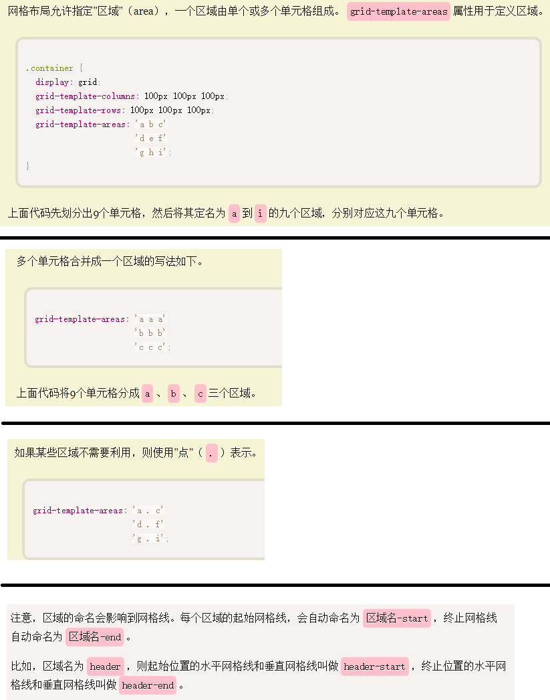

参考：http://www.ruanyifeng.com/blog/2019/03/grid-layout-tutorial.html

# Grid 网格布局教程

    网格布局（Grid）是最强大的 CSS 布局方案。

    它将网页划分成一个个网格，可以任意组合不同的网格，做出各种各样的布局。以前，只能通过复杂的 CSS 框架达到的效果，现在浏览器内置了。

    Grid 布局的属性分成两类。一类定义在容器上面，称为容器属性；另一类定义在项目上面，称为项目属性

# Grid与Flex的异同
    Grid 布局与 Flex 布局有一定的相似性，都可以指定容器内部多个项目的位置。但是，它们也存在重大区别。

    Flex 布局是轴线布局，只能指定"项目"针对轴线的位置，可以看作是一维布局。
    Grid 布局则是将容器划分成"行"和"列"，产生单元格，然后指定"项目所在"的单元格，可以看作是二维布局。Grid 布局远比 Flex 布局强大    

# 基本概念

## 容器和项目
    采用网格布局的区域，称为"容器"（container）
    容器内部采用网格定位的子元素，称为"项目"（item）
    项目只能是容器的顶层子元素，不包含项目的子元素
    Grid 布局只对项目生效

## 行和列
    容器里面的水平区域称为"行"（row），垂直区域称为"列"（column）   

## 单元格
    行和列的交叉区域，称为"单元格"（cell）。
    正常情况下，n行和m列会产生n x m个单元格。比如，3行3列会产生9个单元格     

## 网格线
    划分网格的线，称为"网格线"（grid line）。
    水平网格线划分出行，垂直网格线划分出列。
    正常情况下，n行有n + 1根水平网格线，m列有m + 1根垂直网格线，比如三行就有四根水平网格线 

    

# 容器属性

## 1. display:grid属性，指定一个容器采用网格布局
    默认情况下，容器元素都是块级元素，但也可以设成行内元素:display: inline-grid;

    设为网格布局以后，容器子元素（项目）的float、display: inline-block、display: table-cell、vertical-align和column-*等设置都将失效

## 2. grid-template-columns 属性，grid-template-rows 属性    
    容器指定了网格布局以后，接着就要划分行和列
    grid-template-columns属性定义每一列的列宽
    grid-template-rows属性定义每一行的行高

#### repeat()函数：有时候，重复写同样的值非常麻烦，尤其网格很多时。这时，可以使用repeat()函数，简化重复的值    
    repeat()接受两个参数，第一个参数是重复的次数，第二个参数是所要重复的值。
    display: grid;
    grid-template-columns: repeat(3, 33.33%);
    grid-template-rows: repeat(3, 33.33%);

    repeat()重复某种模式也是可以的。
    grid-template-columns: repeat(2, 100px 20px 80px);

#### auto-fill 关键字：自动填充    
    grid-template-columns: repeat(auto-fill, 100px)即表示：每列宽度100px，然后自动填充，直到容器不能放置更多的列

#### fr 关键字    
    为了方便表示比例关系，网格布局提供了fr关键字（fraction 的缩写，意为"片段"）。
    如果两列的宽度分别为1fr和2fr，就表示后者是前者的两倍
    grid-template-columns: 1fr 1fr; 表示两个相同宽度的列
    grid-template-columns: 150px 1fr 2fr;表示，第一列的宽度为150像素，第二列的宽度是第三列的一半

#### minmax()函数：产生一个长度范围，表示长度就在这个范围之中。它接受两个参数，分别为最小值和最大值。
    grid-template-columns: 1fr 1fr minmax(100px, 1fr);
    minmax(100px, 1fr)表示列宽不小于100px，不大于1fr    

#### auto关键字表示由浏览器自己决定长度
    grid-template-columns: 100px auto 100px;
    上面代码中，第二列的宽度，基本上等于该列单元格的最大宽度，除非单元格内容设置了min-width，且这个值大于最大宽度

#### 网格线的名称
grid-template-columns属性和grid-template-rows属性里面，还可以使用方括号，指定每一根网格线的名字，方便以后的引用。
display: grid;
grid-template-columns: [c1] 100px [c2] 100px [c3] auto [c4];
grid-template-rows: [r1] 100px [r2] 100px [r3] auto [r4];    

## 3. grid-row-gap 属性，grid-column-gap 属性，grid-gap 属性
    grid-row-gap属性设置行与行的间隔（行间距）    grid-row-gap: 20px;
    grid-column-gap属性设置列与列的间隔（列间距）    grid-column-gap: 20px;
    grid-gap属性是grid-column-gap和grid-row-gap的合并简写形式，语法如下：grid-gap: <grid-row-gap> <grid-column-gap>;
    如果grid-gap省略了第二个值，浏览器认为第二个值等于第一个值

    根据最新标准，上面三个属性名的grid-前缀已经删除，grid-column-gap和grid-row-gap写成column-gap和row-gap，grid-gap写成gap。

## grid-template-areas 属性：网格布局允许指定"区域"（area），一个区域由单个或多个单元格组成。grid-template-areas属性用于定义区域  

   

## justify-content 属性，align-content 属性，place-content 属性
    justify-content属性是整个内容区域在容器里面的水平位置（左中右）
    align-content属性是整个内容区域的垂直位置（上中下）。

    start：对齐单元格的起始边缘。
    end：对齐单元格的结束边缘。
    center：单元格内部居中。
    stretch：拉伸，占满单元格的整个宽度（默认值）

    place-items属性是align-items属性和justify-items属性的合并简写形式。
    如果省略第二个值，则浏览器认为与第一个值相等

## justify-content 属性，align-content 属性，place-content 属性    
    justify-content属性是整个内容区域在容器里面的水平位置（左中右）
    align-content属性是整个内容区域的垂直位置（上中下）

    start：对齐容器的起始边缘。
    end：对齐容器的结束边缘。
    center：容器内部居中。
    stretch：项目大小没有指定时，拉伸占据整个网格容器
    space-around ： 每个项目两侧的间隔相等。所以，项目之间的间隔比项目与容器边框的间隔大一倍
    space-between：项目与项目的间隔相等，项目与容器边框之间没有间隔
    space-evenly：项目与项目的间隔相等，项目与容器边框之间也是同样长度的间隔

    place-content属性是align-content属性和justify-content属性的合并简写形式

## grid-auto-columns 属性，grid-auto-rows 属性
    有时候，一些项目的指定位置，在现有网格的外部。比如网格只有3列，但是某一个项目指定在第5行。这时，浏览器会自动生成多余的网格，以便放置项目。

    grid-auto-columns属性和grid-auto-rows属性用来设置，浏览器自动创建的多余网格的列宽和行高。它们的写法与grid-template-columns和grid-template-rows完全相同。如果不指定这两个属性，浏览器完全根据单元格内容的大小，决定新增网格的列宽和行高。

$("#service_query").data().ids;

    value.value = ids.join(",");

