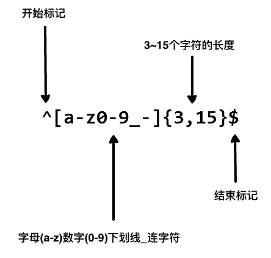

###### 参考文档 http://www.runoob.com/regexp/regexp-tutorial.html
###### 测试工具:
    regexbuddy：http://www.regexbuddy.com/
    在线测试工具：http://tool.chinaz.com/regex
# 介绍
    正则表达式(Regular Expression)是一种文本模式，包括普通字符（例如，a 到 z 之间的字母）和特殊字符（称为"元字符"）
    正则表达式使用单个字符串来描述、匹配一系列匹配某个句法规则的字符串
    正则表达式(regular expression)描述了一种字符串匹配的模式（pattern），可以用来检查一个串是否含有某种子串、将匹配的子串替换或者从某个串中取出符合某个条件的子串等

# 作用
    测试字符串内的模式：例如，可以测试输入字符串，以查看字符串内是否出现电话号码模式或信用卡号码模式。这称为数据验证。
    替换文本：可以使用正则表达式来识别文档中的特定文本，完全删除该文本或者用其他文本替换它。
    基于模式匹配从字符串中提取子字符串：可以查找文档内或输入域内特定的文本。

# 最常用的通配符
    ^ 匹配输入字符串的开始位置
    $ 匹配输入字符串的结束位置
    
    ? 匹配文件名中的 0 个或 1 个
    * 匹配零个或多个
    + 匹配一个或多个
    
    . 匹配除了换行符以外的所有字符
    \w 匹配字母或数字或下划线或汉字
    \s 匹配任意的空白符
    \d 匹配数字
    \b 匹配单词的开始或结束
    

    