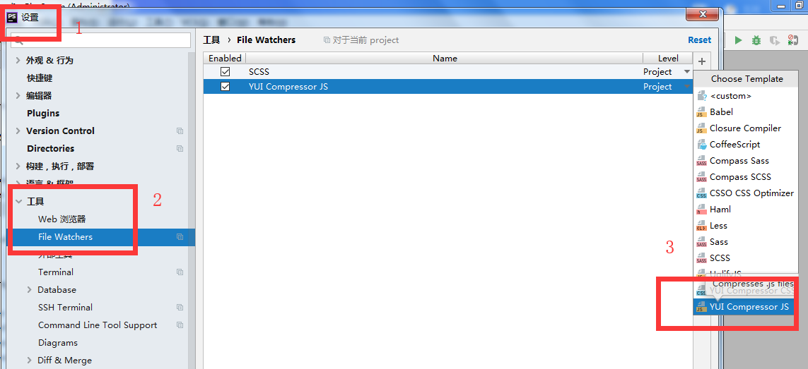

# 配置YUI Compressor
#### 1.安装java文件（jre-8u201-windows-x64.exe）
#### 2. Phpstrom配置：设置-工具-file watcher

#### 3. 配置YUI Compressor参数
###### Program参数：
    D:\MyLocalSoftWare\compressTool\java\bin\javaw
###### Arguments参数：
    -jar "D:\MyLocalSoftWare\compressTool\yuicompressor-2.4.8.jar"  $FileName$ -o $FileNameWithoutExtension$.min.js
###### Output path to refresh参数：
    $FileNameWithoutExtension$.min.js
#### 4 编译js文件将会自动压缩为对应的XXX.min.js

# 配置sass
#### 1 安装Ruby 
    http://www.runoob.com/ruby/ruby-installation-windows.html
#### 2. 安装sass
    https://blog.csdn.net/qq_36543956/article/details/79403161
#### 3. 配置参数
###### Program参数
    D:\MyLocalSoftWare\Ruby26-x64\bin\sass
###### Arguments参数
    --no-cache --update --style compressed --sourcemap=none $FileName$:$FileNameWithoutExtension$.css
###### Output path to refresh参数
    $FileNameWithoutExtension$.css:$FileNameWithoutExtension$.css.map